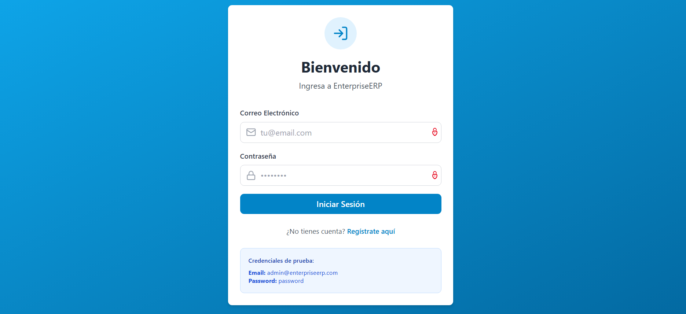
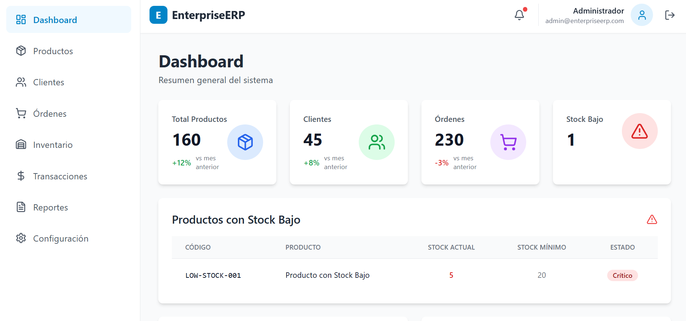
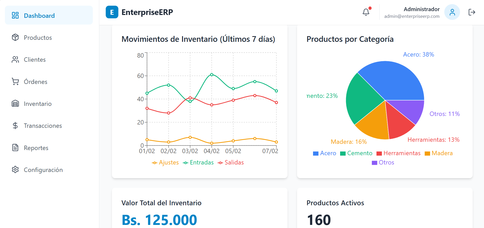
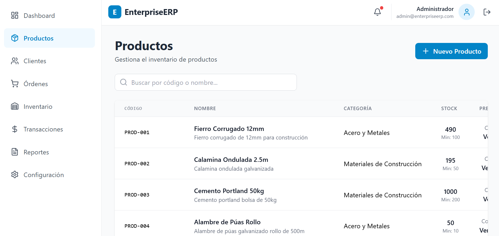
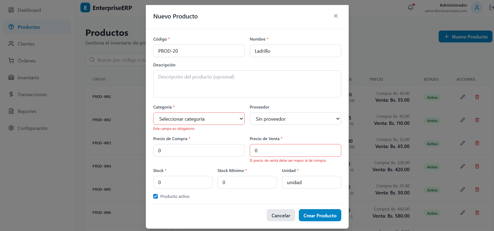
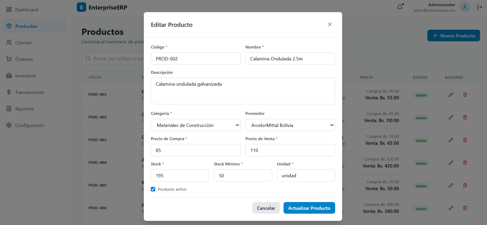
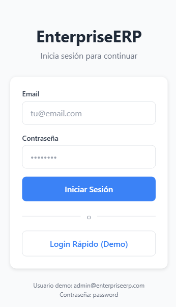
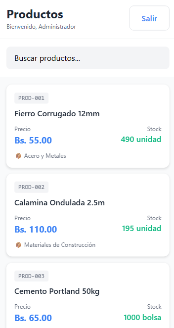

# 🏢 EnterpriseERP

Modern full-stack ERP system with Laravel backend, React frontend, and React Native mobile app.

## 🚀 Technology Stack

### Backend
- Laravel 12
- SQL Server
- JWT Authentication
- GraphQL (Lighthouse)
- N8N Integration
- PDF/Excel Reports

### Frontend Web
- React 19
- TypeScript
- Apollo Client
- Tailwind CSS
- Recharts
- React Hook Form + Zod

### Mobile
- React Native
- Expo SDK 54
- TypeScript
- React Navigation
- AsyncStorage

## 📚 Implemented Modules

- Authentication
- Dashboard
- Products

## 🚀 Key Features

### ✅ Authentication System
- Login/Register with validation
- JWT tokens with refresh
- Session persistence
- Route protection

### 📊 Interactive Dashboard
- Real-time KPIs (products, customers, orders, low stock)
- Charts with Recharts (line and pie)
- Products with critical stock (GraphQL)
- Responsive design

### 📦 Product Management (Full CRUD)
- Create, edit, delete products
- Search with debounce (500ms)
- Cross-field validation (selling price > purchase price)
- Pagination
- Relationships (categories, suppliers)
- Computed fields (low stock, margin)

### 📱 Native Mobile Application
- Login con JWT
- Product list with virtualized FlatList
- Search with debounce
- Pull to refresh
- Infinite scroll (pagination)
- Persistence with AsyncStorage

## 📸 Screenshots

### Web Dashboard







### Mobile App



## 🛠️ Installation

### Backend
```bash
cd backend
composer install
cp .env.example .env
php artisan key:generate
php artisan migrate --seed
php artisan serve
```

### Frontend Web
```bash
cd frontend
npm install
cp .env.example .env
npm run dev
```

### Mobile
```bash
cd mobile
npm install
cp .env.example .env
npx expo start
```